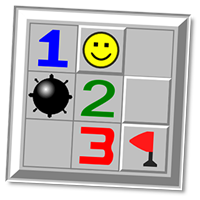

# MineSweeper 
> The good old Minesweeper game! Including several extra features.

## General Information
This is the "Sprint #1" project of the Coding Academy web-development course. Written in 4 days in Vanilla JavaScript after only two weeks of coding, this is my first ever attempt in creating a complete web-app. 

## Technologies Used
- HTML5
- CSS3
- JavaScript - ES6

## Features
List the ready features here:

- 3 difficulty levels.
- 3 lives.
- 3 hints for uncovering a small part of the board for few seconds.
- 3 safe clicks to mark a safe place to click next.
- Recursive opening of empty cells.
- First click is never a mine. 
- Best scores are saved to local storage.
- Undo button. 
- "7 Boom!" button - to create a board with a mine in every 7th cell. 

## Screenshots

## Usage
- Use a left mouse click on any unrevealed cell in order to reveal it's content. 
- Use a right mouse click on any unrevealed cell in order to mark it with a flag. 
- Every revealed cell shows a number indicating the number of mines found in adjacent cells, or a mine. 
- In order to win the game reveal all empty cells and mark with a flag all the cells that contain a mine! 
- If you step on 3 mines you lose!
- You can click on the light bulb to the left side and then on any unreveald cell on the board in order to get a hint. 
- You can also click the safe click button to see a hint on the board for a safe cell you can click next. 
- You can undo steps using the undo button.
- In order for a record to be saved there is a requirement for a "clean win" - which means winning without using any of the extra features supplied. 
- You can click the smiley at any time to restart the game.

## Project Status
Project is: _no longer being worked on_. 
Reason: Moved to work on higher scale projects.

## Room for Improvement
- Bug fixes: 
  - In the "7 Boom!" board when first click is a mine there's no reduction of life for that click.
- Add more features: 
  - Manually positioned mines.
  - Change settings feature. 
- Improve style, UI, and responsive design.
